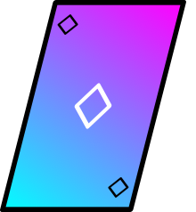

# Open Source Casino

   

## Motivation

Stakes and rewards in this casino are fake. This casino will never give the excitement caused by chasing meaningful rewards. That is not the goal though and will never be. The only excitement that is available here is the one caused by satisfying, easy and intuitive gameplay. This project also gives you an insight why you should never think of a casino as a way to make money.

## Retrieving the currency

Amount of your cyberdonuts is stored in local storage in your browser. To retrieve them:

- head over to the developer console in your browser and in **Application** tab, under **Local Storage** section select the website url and modify the **points** value
- clear browsing data in your browser's settings

---

## Configured scripts

Before running any script install dependencies and configure [Husky Git hook](https://typicode.github.io/husky/#/):

```
npm i
npm run prepare
```

Local development mode:

```
npm run dev
```

Running tests:

```
npm run test
```

Get test coverage:

```
npm run coverage
```
